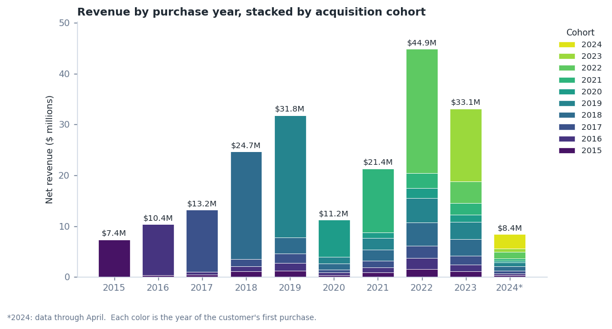
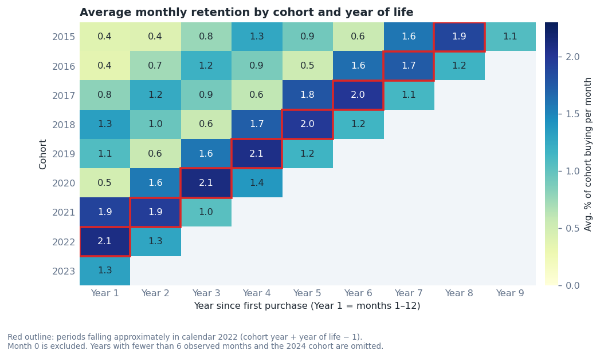
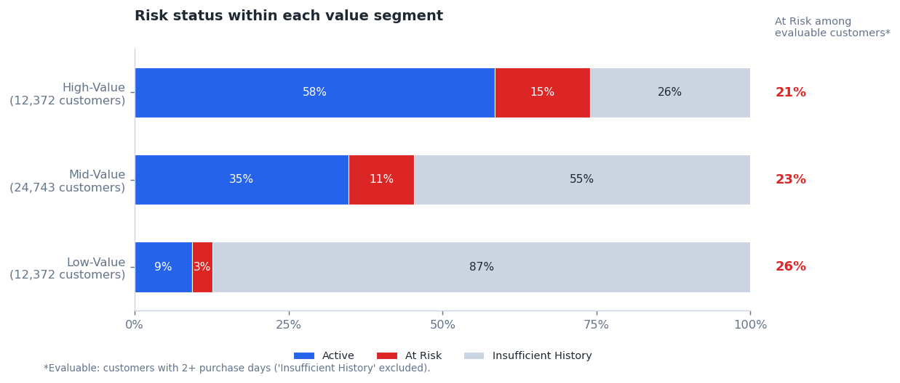

# Cohort, Segmentation and Customer Retention Analysis with SQL

*[Leer en español](README.es.md)*

SQL (PostgreSQL) analysis of the sales of a fictional retail/e-commerce company, from January 2015 to April 2024 (partial year). The goal is to answer three business questions: how to segment customers by their lifetime value (LTV) and purchasing behavior, how each cohort (a group of customers defined by the year of their first purchase) evolves in revenue and retention, and which customers are at risk of churning and require retention actions. To answer them, the project builds a full RFM segmentation (recency, frequency and monetary value), revenue and retention curves per cohort measured in months, a risk threshold personalized to each customer's purchase rhythm, and a cross-tabulation of segment by risk.

## Questions

| # | Question | Technique* |
|---|---|---|
| 0a | How much revenue did the customers of each cohort generate, by purchase year? | `EXTRACT` + `GROUP BY` |
| 0b | How many customers of each cohort made purchases in each year? | `SELECT DISTINCT` + `COUNT() OVER (PARTITION BY)` |
| 1.1 | What percentage of the total LTV does each segment hold? | `PERCENTILE_CONT` + `CASE` + subquery for the total |
| 1.2 | What is each customer's score in recency, frequency and monetary value? | `NTILE(4)` + `CONCAT` |
| 2 | What percentage of each cohort's total revenue is generated in each month of life, counted from the first purchase? | Date arithmetic with `EXTRACT` + `JOIN` to a fixed total per cohort |
| 3 | How can customer risk be categorized according to each customer's usual purchase rhythm? | `LAG` + `AVG` + `ROW_NUMBER` + `CASE` |
| 4 | What percentage of the customers in each cohort buys in each month elapsed since their first purchase? | `COUNT(DISTINCT)` + `JOIN` to a fixed cohort size |
| 5 | What percentage of the customers in each segment falls into each risk category? | `JOIN` of CTEs + `SUM() OVER (PARTITION BY customer_segment)` |

\*Except for 0a, the queries are organized with CTEs.

## Data

### Source

Contoso is the name of a fictional company used in Microsoft examples. The data in this analysis is synthetic: it is produced by SQLBI's [Contoso Data Generator V2](https://github.com/sql-bi/Contoso-Data-Generator-V2) (MIT license). The file used was [`contoso_100k.sql`](https://github.com/lukebarousse/Int_SQL_Data_Analytics_Course/releases/download/v.0.0.0/contoso_100k.sql), a PostgreSQL dump published in the materials of Luke Barousse's [intermediate SQL course](https://github.com/lukebarousse/Int_SQL_Data_Analytics_Course), whose author states it was obtained from that generator. The file is not included in this repository.

### Contents

The full database has six tables (`currencyexchange`, `date`, `store`, `customer`, `product` and `sales`); this analysis uses only `sales` and `customer`.

- **`sales`:** one row per sale line (`orderkey`, `customerkey`, `orderdate`, `quantity`, `netprice`, `exchangerate`).
- **`customer`:** data for each customer (`customerkey`, `countryfull`, `age`, `givenname`, `surname`).

Sales run from January 2015 to April 2024 (partial year) and involve 49,487 customers. The net revenue of each line is `quantity * netprice * exchangerate`.

### Tools

- Local PostgreSQL (version 18)
- DBeaver Community, to run the queries and export results
- Jupyter / Google Colab notebooks, to iterate on the queries before consolidating them
- Python (matplotlib), for the charts, from the exported CSVs

### Database setup

A `contoso_100k` database was created on a local PostgreSQL instance and the `contoso_100k.sql` file was loaded. Then `queries/0_cohort_analysis_view.sql` was run, which creates the `cohort_analysis` view (one row per customer and purchase day, with `first_purchase_date` and `cohort_year`). The remaining queries read from that view and can be run in any order.

### What comes from the course and what is my own

The project starts from the course's three-question outline (segmentation, cohorts and retention) and extends it.

| File | Origin |
|---|---|
| `0_cohort_analysis_view.sql` | From the course, unchanged |
| `0a`, `0b` | From the course, adapted to the view |
| `1_1_customer_segmentation.sql` | Course baseline |
| `1_2_customer_rfm.sql` | Own: adds recency and frequency to the monetary-value segmentation |
| `2_cohort_analysis.sql` | Own extension: per-cohort curve in months, instead of per day with all cohorts mixed together |
| `3_customer_retention_analysis.sql` | Own extension: risk threshold based on each customer's own rhythm, instead of a fixed 6-month cutoff |
| `4_cohort_retention_curve.sql` | Own |
| `5_segment_risk_crosstab.sql` | Own |

## Findings

### 1. Revenue and customers by cohort and purchase year (0a, 0b)



- **Total revenue:** the peak is in 2022 ($44.9M) and the drop in 2020 ($11.2M, ~65% less than in 2019).
- Cohorts 2015–2018 move together (taking each cohort's 2019 revenue as a base of 100): ~30–36 in 2020 and ~127–140 in 2022. The calendar year matters more than the cohort.
- Share of revenue coming from the new cohort: 100% in 2015, 54% in 2022 and 43% in 2023.
- Customers from earlier cohorts who buy in the year: 2,496 in 2019 and 7,378 in 2022.
- 2024 is a partial year: there are records only through April.

<details>
<summary>View SQL — <code>0a_revenue_by_cohort_year.sql</code></summary>

```sql
SELECT
    cohort_year,
    EXTRACT(YEAR FROM orderdate) AS purchase_year,
    SUM(total_net_revenue) AS net_revenue
FROM cohort_analysis
GROUP BY cohort_year, purchase_year
ORDER BY cohort_year, purchase_year;
```
</details>

<details>
<summary>View SQL — <code>0b_customers_by_cohort_year.sql</code></summary>

```sql
WITH yearly_cohort AS (
    SELECT DISTINCT
    customerkey,
    cohort_year,
    EXTRACT(YEAR FROM orderdate) AS purchase_year
FROM cohort_analysis
)
  SELECT DISTINCT
  cohort_year,
  purchase_year,
  COUNT(*) OVER (PARTITION BY purchase_year, cohort_year) AS num_customers
FROM yearly_cohort
ORDER BY cohort_year, purchase_year
```
</details>

### 2. Segmentation by value and RFM (1.1, 1.2)

- High-Value: 12,372 customers, 65.6% of LTV, average LTV $10,946.
- Mid-Value: 24,743 customers, 32.3% of LTV, average LTV $2,693.
- Low-Value: 12,372 customers, 2.1% of LTV, average LTV $351.
- RFM: 64 possible combinations; the most frequent are 111 (3,426 customers) and 444 (2,848 customers).

<details>
<summary>View SQL — <code>1_1_customer_segmentation.sql</code></summary>

```sql
WITH customer_ltv AS (
SELECT
    customerkey,
    SUM(total_net_revenue) AS total_ltv
FROM cohort_analysis
GROUP BY customerkey
),
customer_segments AS (
SELECT
      PERCENTILE_CONT(0.25) WITHIN GROUP (ORDER BY total_ltv) AS percentile_25th,
      PERCENTILE_CONT(0.75) WITHIN GROUP (ORDER BY total_ltv) AS percentile_75th
FROM customer_ltv
),
segment_values AS (
SELECT 
  c.customerkey,
  c.total_ltv,
  CASE 
      WHEN c.total_ltv < percentile_25th THEN '1 - Low-Value' 
      WHEN c.total_ltv BETWEEN percentile_25th AND percentile_75th THEN '2 - Mid-Value'
      ELSE '3 - High-Value' 
    END AS customer_segment
FROM customer_ltv c, customer_segments
)
SELECT 
  customer_segment,
  SUM(total_ltv) AS total_ltv,
  SUM(total_ltv)/ (SELECT SUM (total_ltv) FROM segment_values) AS ltv_pct,
  COUNT(customerkey) AS customer_count,
  SUM(total_ltv)/ COUNT(customerkey) AS avg_ltv
FROM segment_values 
GROUP BY customer_segment
ORDER BY total_ltv DESC;
```
</details>

<details>
<summary>View SQL — <code>1_2_customer_rfm.sql</code></summary>

```sql
WITH customer_rfm_base AS (
SELECT
	  customerkey,
	  (SELECT MAX(orderdate) FROM cohort_analysis) - MAX(orderdate) AS recency_days,
	  SUM(num_orders) AS frequency,
	  SUM(total_net_revenue) AS monetary
FROM cohort_analysis
GROUP BY customerkey
),
customer_rfm_quartiles AS (
SELECT 
      customerkey,
      recency_days,
      frequency,
      monetary,
      NTILE(4) OVER (ORDER BY recency_days DESC) AS recency_quartile,
      NTILE(4) OVER (ORDER BY frequency ASC) AS frequency_quartile,
      NTILE(4) OVER (ORDER BY monetary ASC) AS monetary_quartile
FROM customer_rfm_base
)
SELECT 
	  customerkey,
	  recency_quartile,
	  frequency_quartile,
	  monetary_quartile,
	  CONCAT(recency_quartile, frequency_quartile, monetary_quartile) AS rfm_score
FROM customer_rfm_quartiles
```
</details>

### 3. Revenue curve by cohort, in months (2)

- Month 0 accounts for 49% of the 2015 cohort's LTV and 98% of the 2024 cohort's, but this is due to the time horizon: the 2015 cohort has 111 months of purchase history, while the 2024 cohort has only 3.
- At the same horizon (revenue of months 1–12 over that of month 0): ~4–10% for 2015–2017, ~11–17% for 2018–2019 and ~23% for 2021–2022.
- The 2021–2022 cohorts repeat purchases more in their first year, but that year coincides with the 2022 peak.

<details>
<summary>View SQL — <code>2_cohort_analysis.sql</code></summary>

```sql
WITH month_since_purchase AS (
SELECT
  first_purchase_date,
  cohort_year,
 (EXTRACT(YEAR FROM orderdate) - EXTRACT(YEAR FROM first_purchase_date)) * 12  +
 (EXTRACT(MONTH FROM orderdate) - EXTRACT(MONTH FROM first_purchase_date)) AS month_from_first_purchase,
 total_net_revenue
FROM cohort_analysis
), cohort_monthly_revenue AS (
SELECT
    month_from_first_purchase,
    cohort_year,
    SUM(total_net_revenue) AS net_revenue
FROM month_since_purchase
GROUP BY month_from_first_purchase, cohort_year
),
cohort_revenue AS (
SELECT
  cohort_year,
  SUM(total_net_revenue) AS client_ltv
FROM month_since_purchase
GROUP BY cohort_year
)
SELECT
  cr.cohort_year,
  month_from_first_purchase,
  net_revenue,
  cr.client_ltv,
  ROUND((net_revenue/client_ltv)::NUMERIC,3) AS pct_of_total_revenue
FROM cohort_monthly_revenue cm
INNER JOIN cohort_revenue cr ON cm.cohort_year = cr.cohort_year
ORDER BY cr.cohort_year, month_from_first_purchase;
```
</details>

### 4. Retention and risk per customer (3, 4)



- **Query 3:** out of 49,487 customers, 55.7% have insufficient history (they bought only once), 34.3% are Active and 10% are At Risk.
- Among those who can be evaluated (21,939), 22.6% are At Risk.
- Median days since last purchase: 409 for Active, 1,374 for At Risk and 967 for insufficient history.
- **Query 4:** month 0 is 100% by construction; after that, ~0.4–2% of the cohort buys each month, with no decay. Average of months 1–12 for the 2015–2020 cohorts: ~0.7%; around months 36–40, ~1.3%.
- The retention peak of each cohort falls around 2022 (month 84 for 2015, month 41 for 2019, month 15 for 2021): the same calendar effect as in point 1.

<details>
<summary>View SQL — <code>3_customer_retention_analysis.sql</code></summary>

```sql
WITH days_prev_purchase AS (
SELECT
	customerkey,
	orderdate,
	LAG(orderdate) OVER (PARTITION BY customerkey ORDER BY orderdate) AS previous_orderdate,
	(orderdate - LAG(orderdate) OVER (PARTITION BY customerkey ORDER BY orderdate)) AS days_since_prev_purchase
FROM cohort_analysis
), avg_prev_purchase AS (
SELECT
	customerkey,
	AVG(days_since_prev_purchase) AS avg_days_prev_purchase
FROM days_prev_purchase
GROUP BY customerkey
), row_num AS (
SELECT
	customerkey,
	orderdate,
	ROW_NUMBER() OVER (PARTITION BY customerkey ORDER BY orderdate DESC) AS rn
FROM days_prev_purchase
), max_diff AS(
SELECT
	customerkey,
	(SELECT MAX(orderdate) FROM cohort_analysis) - orderdate AS days_diff_date
FROM row_num
WHERE rn = 1
)
SELECT
	m.customerkey,
	days_diff_date,
-- Threshold: flagged 'At Risk' once a customer's gap since last purchase
-- exceeds double their own historical average gap between purchases.
	CASE
		WHEN avg_days_prev_purchase IS NULL THEN 'Insufficient History'
		WHEN days_diff_date > avg_days_prev_purchase * 2 THEN 'At Risk'
		ELSE 'Active'
	END AS client_risk
FROM max_diff m
INNER JOIN avg_prev_purchase a ON m.customerkey = a.customerkey
```
</details>

<details>
<summary>View SQL — <code>4_cohort_retention_curve.sql</code></summary>

```sql
WITH customer_month_activity AS (
SELECT
  cohort_year,
  customerkey,
 (EXTRACT(YEAR FROM orderdate) - EXTRACT(YEAR FROM first_purchase_date)) * 12  +
 (EXTRACT(MONTH FROM orderdate) - EXTRACT(MONTH FROM first_purchase_date)) AS month_from_first_purchase
FROM cohort_analysis
), cohort_customers AS (
SELECT
      cohort_year,
       COUNT(DISTINCT customerkey) AS cohort_size
FROM customer_month_activity
GROUP BY cohort_year
), cohort_month_customers AS (
SELECT 
  cohort_year,
  month_from_first_purchase,
  COUNT(DISTINCT customerkey) AS active_customers
FROM customer_month_activity
GROUP BY cohort_year, month_from_first_purchase
)
SELECT 
  c.cohort_year,
  m.month_from_first_purchase,
  ROUND((m.active_customers::NUMERIC/c.cohort_size::NUMERIC),3) AS retention_pct
FROM cohort_customers c
INNER JOIN cohort_month_customers m ON  c.cohort_year = m.cohort_year
```
</details>

### 5. Segment × risk cross-tabulation (5)



- At Risk rises with value: 3% (Low), 11% (Mid), 15% (High).
- But the weight of "insufficient history" changes: 87%, 55% and 26%.
- Among evaluable customers, At Risk is 26% (Low), 23% (Mid) and 21% (High): valuable customers are no more likely to leave than the rest.
- Actionable: 1,911 High-Value At Risk customers and 3,226 High-Value customers with a single purchase day, for whom there is not enough data to assess risk.

<details>
<summary>View SQL — <code>5_segment_risk_crosstab.sql</code></summary>

```sql
WITH customer_ltv AS (
    SELECT
        customerkey,
        SUM(total_net_revenue) AS total_ltv
    FROM cohort_analysis
    GROUP BY customerkey
),

customer_segments AS (
    SELECT
        PERCENTILE_CONT(0.25) WITHIN GROUP (ORDER BY total_ltv) AS percentile_25th,
        PERCENTILE_CONT(0.75) WITHIN GROUP (ORDER BY total_ltv) AS percentile_75th
    FROM customer_ltv
),

segment_values AS (
    SELECT
        c.customerkey,
        c.total_ltv,
        CASE
            WHEN c.total_ltv < percentile_25th THEN '1 - Low-Value'
            WHEN c.total_ltv BETWEEN percentile_25th AND percentile_75th THEN '2 - Mid-Value'
            ELSE '3 - High-Value'
        END AS customer_segment
    FROM customer_ltv c, customer_segments
),

days_prev_purchase AS (
    SELECT
        customerkey,
        orderdate,
        LAG(orderdate) OVER (PARTITION BY customerkey ORDER BY orderdate) AS previous_orderdate,
        (orderdate - LAG(orderdate) OVER (PARTITION BY customerkey ORDER BY orderdate))
            AS days_since_prev_purchase
    FROM cohort_analysis
),

avg_prev_purchase AS (
    SELECT
        customerkey,
        AVG(days_since_prev_purchase) AS avg_days_prev_purchase
    FROM days_prev_purchase
    GROUP BY customerkey
),

row_num AS (
    SELECT
        customerkey,
        orderdate,
        ROW_NUMBER() OVER (PARTITION BY customerkey ORDER BY orderdate DESC) AS rn
    FROM days_prev_purchase
),

max_diff AS (
    SELECT
        customerkey,
        (SELECT MAX(orderdate) FROM cohort_analysis) - orderdate AS days_diff_date
    FROM row_num
    WHERE rn = 1
),

risk_category AS (
    SELECT
        m.customerkey,
        days_diff_date,
        CASE
            WHEN avg_days_prev_purchase IS NULL THEN 'Insufficient History'
            WHEN days_diff_date > avg_days_prev_purchase * 2 THEN 'At Risk'
            ELSE 'Active'
        END AS client_risk
    FROM max_diff m
    INNER JOIN avg_prev_purchase a ON m.customerkey = a.customerkey
),

segment_risk AS (
    SELECT
        s.customer_segment,
        r.client_risk,
        COUNT(s.customerkey) AS client_count
    FROM segment_values s
    INNER JOIN risk_category r ON s.customerkey = r.customerkey
    GROUP BY s.customer_segment, r.client_risk
)

SELECT
    customer_segment,
    client_risk,
    client_count,
    SUM(client_count) OVER (PARTITION BY customer_segment) AS segment_total,
    ROUND(
        client_count::NUMERIC / SUM(client_count) OVER (PARTITION BY customer_segment)::NUMERIC,
        3
    ) AS segment_pct
FROM segment_risk
ORDER BY customer_segment, client_count DESC;
```
</details>

## Limitations

- Contoso is a sample dataset: patterns such as the 2022 peak do not necessarily reflect a real business.
- The reference date ("today") is the last date in the dataset, April 2024, not the current date.
- The risk threshold (×2 the usual purchase interval) is an adjustable criterion, not a rule; it will depend on business needs.
- Recent cohorts have fewer observed months, which does not necessarily lead to fair comparisons.
- `NTILE` does not resolve ties: customers with the same frequency value can fall into different quartiles.
- 56% of customers bought on a single day, so the risk analysis covers less than half of the base.

## Conclusion

- It is evident that this is an acquisition-driven business with little repeat purchasing. 56% of customers bought on a single day, and monthly cohort retention hovers around 0.7% with no decay.
- The calendar year matters more than the cohort. 2020 drops for all cohorts and 2022 is the peak for all, so it is worth separating when customers were acquired from when they bought.
- Value is concentrated: the High-Value 25% brings in 65.6% of LTV, and the Low-Value 25% only 2.1%.
- Among evaluable customers, risk is similar across the three segments (21–26%).
- What is actionable: the 1,911 High-Value At Risk customers and the 3,226 High-Value customers with a single purchase day, whom the method cannot evaluate.

## What I took away from this project

The hardest part was chaining CTEs and using window functions. These were the main complications and how they were solved:

- **Percentages with a fixed denominator.** To know what share of a cohort's revenue falls in each month, you need that cohort's total. *Solution:* compute it in a separate CTE and join it with `JOIN`.
- **Row-by-row and grouped calculations in the same query.** `LAG` works row by row and `AVG` groups by customer. *Solution:* split them into two chained CTEs.
- **Filtering the result of a window function.** `WHERE` runs before the window function. *Solution:* compute `ROW_NUMBER()` in one CTE and filter `rn = 1` in the next layer.
- **Customers without enough history to evaluate.** Customers who bought only once have no usual purchase rhythm to compare against. *Solution:* classify them separately as "Insufficient History" instead of assuming they are active.

Testing each CTE separately before chaining the next one helped me avoid carrying errors across layers.

## Repository structure

```
sql_cohort-analysis/
├── README.md
├── README.es.md
├── queries/
│   ├── 0_cohort_analysis_view.sql
│   ├── 0a_revenue_by_cohort_year.sql
│   ├── 0b_customers_by_cohort_year.sql
│   ├── 1_1_customer_segmentation.sql
│   ├── 1_2_customer_rfm.sql
│   ├── 2_cohort_analysis.sql
│   ├── 3_customer_retention_analysis.sql
│   ├── 4_cohort_retention_curve.sql
│   └── 5_segment_risk_crosstab.sql
└── assets/
    ├── 01_revenue_by_cohort.png
    ├── 02_segment_risk.png
    └── 03_retention_curve.png
```
